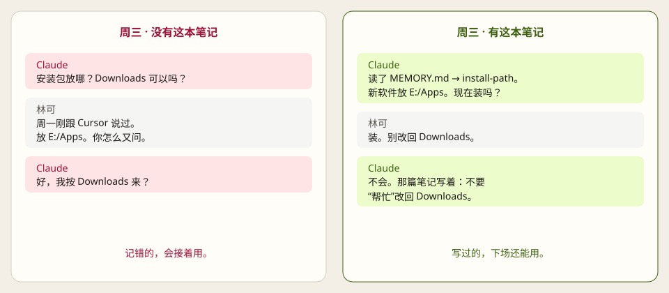
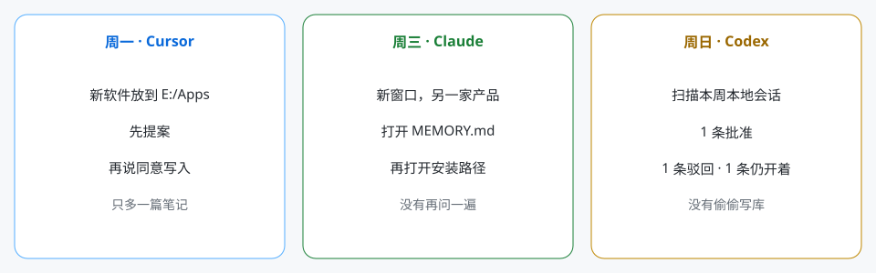

# 一本笔记，给你用的每一家 AI 看

[](https://github.com/hc-ui/cross-ai-memory/actions/workflows/ci.yml)
[](LICENSE)

**给别人看的页：** [hc-ui.github.io/cross-ai-memory](https://hc-ui.github.io/cross-ai-memory/)

[English](README.md) · [简体中文](README.zh-CN.md) · [English site](https://hc-ui.github.io/cross-ai-memory/en.html)

早上你跟 Cursor 说好了下载目录。
晚上换 Claude，它又问一遍。
下周开 Codex，它当没这回事。

不是模型不够聪明。是每家 AI 各有一本小账，而且那本账你通常打不开。以后用 AI 的人会更多，一个人同时用两家、三家也会更普通。这个缺口不会自己消失。

**长期要记住的东西，写成你能打开的笔记。所有 AI 都读同一本。模型可以提案，你点头才许写。**

往群里先丢这一句：

```text
一本笔记给所有 AI 看。模型只能提案，你点头才写入。
https://hc-ui.github.io/cross-ai-memory/
```



## 先别看说明，先点开这本正在用的笔记

[examples/lin-ke/MEMORY.md](examples/lin-ke/MEMORY.md) 是一本**虚构**、但已经在运转的记忆库。林可不是真人。文件是真的。

| 点开 | 故事里发生了什么 |
| --- | --- |
| [install-path.md](examples/lin-ke/shared/install-path.md) | 周一：Cursor 得到「同意写入」后写下 `E:/Apps` |
| [MEMORY.md](examples/lin-ke/MEMORY.md) | 周三：Claude 从这里进，没有再问路径 |
| [week-2026-08-24.md](examples/lin-ke/proposals/week-2026-08-24.md) | 周日：Codex 只出清单 |
| [leafbox.md](examples/lin-ke/work/leafbox.md) | 写错过一次，又改了回来 |
| [CHANGELOG.md](examples/lin-ke/shared/CHANGELOG.md) | 权限记在这里，diff 交给 Git |

一整周：[docs/walkthrough.zh-CN.md](docs/walkthrough.zh-CN.md) · 或者跑 `aimem tour`



## 原理，就这三句

1. 长期记忆放在 **你能打开的 Markdown** 里，不放在厂商的隐藏脑子里。
2. **每家 AI 读同一个文件夹。** Cursor、Claude、Codex、Grok，共用一本。
3. **AI 可以提案，你没点头它不能写。** 记错的东西，不许变成“事实”。

这就是全部发明。命令行可以不装。

## 为什么不让 AI 自己记

现在常见的做法是：把对话全吞进去，做成向量，下次再“相关注入”。省事。错的地方在于——一次猜错，下周会当成既定事实。

这套方法失败得很无聊：你忘了写一条。
自动记忆失败得很危险：它写错了，还接着用。

厂商自带的记忆，够用在“我们刚才聊了什么”。
它当不了跨窗口、跨工具、跨星期的唯一真相。

演示里 Codex 提过「改 README 涨星」。林可驳回了。驳回留在当周清单上，下周扫描不能再拎出来。

## 不装也能抄

把下面这段贴进每一家 AI 的规则，改掉文件夹路径就行。

```text
长期记忆是一个本地 Markdown 文件夹。
先读 MEMORY.md，再只打开索引点名的那几篇。
不要把整个文件夹读完。
除非我明确说「记住 / remember / 同意写入 / approve write」，不要写笔记。
先提最小改动。
不要存 Token、密码、Cookie。
```

一个主题只留一篇正文。你现在说的，大于旧笔记。现场核过的事实，大于猜测。两篇打架就摊开说，不许悄悄覆盖。

## 想先跑起来

```bash
pip install git+https://github.com/hc-ui/cross-ai-memory.git
aimem tour
aimem rule
aimem check examples/lin-ke
aimem init --demo ./look
```


`aimem init` 复制空壳。`aimem init --demo` 复制林可那本正在用的。

把 `adapters/cursor.md`（或 Claude / Codex）里的 `<VAULT>` 换成这个文件夹。问一个需要上周决定的问题。它应该先打开 `MEMORY.md`，再读一两篇。

只有你想落笔记时再说「记住」。

- 命令和采集器：[docs/cli.md](docs/cli.md)
- 不该漂的规则：[SPEC.md](SPEC.md)
- 常见问题：[docs/faq.zh-CN.md](docs/faq.zh-CN.md)

## 这不是什么

- 不是云端记忆 API
- 不是向量数据库
- 不是去同步 ChatGPT / Claude / Cursor 产品里的隐藏记忆
- 不是真人笔记 — `examples/lin-ke` 只是标本

只在本地跑。没有 API key。不要把真正的生活公开出去。

## License

[MIT](LICENSE)
